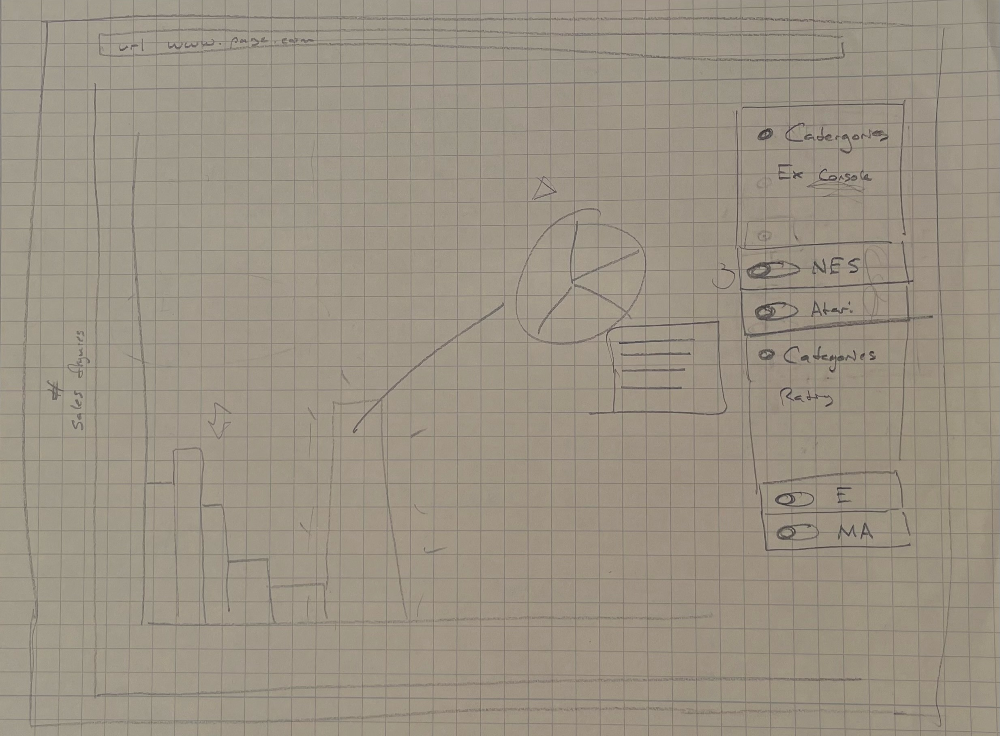
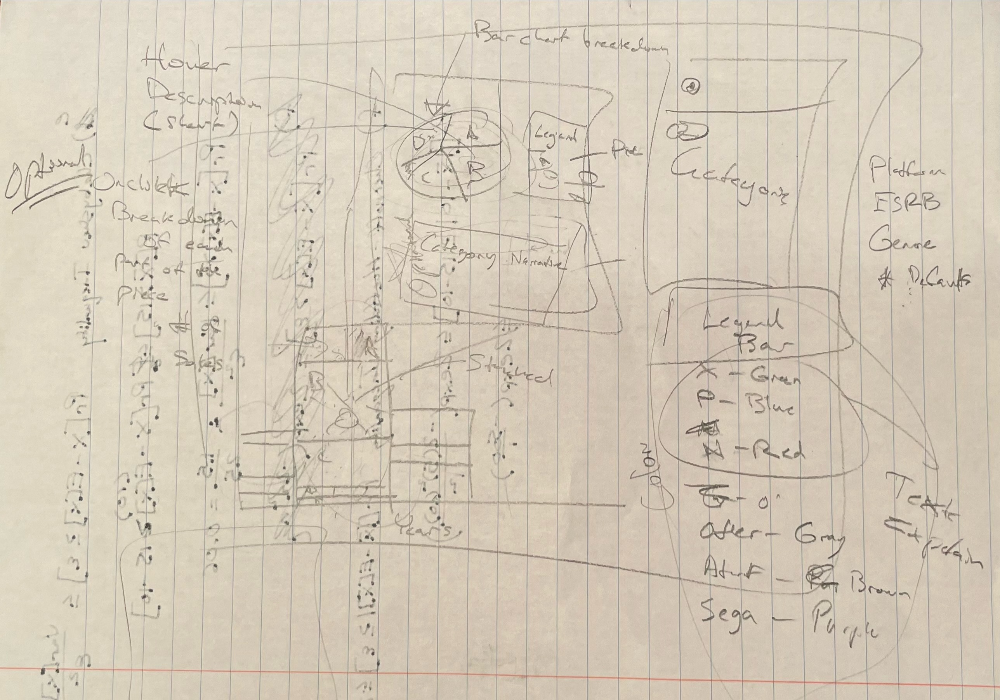
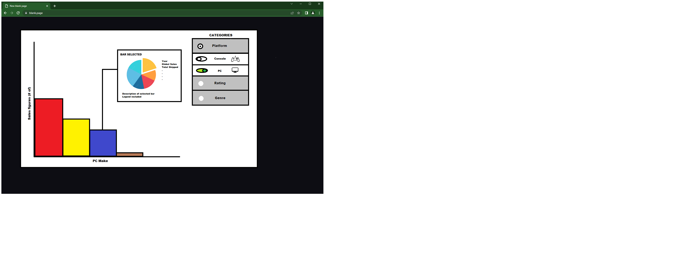
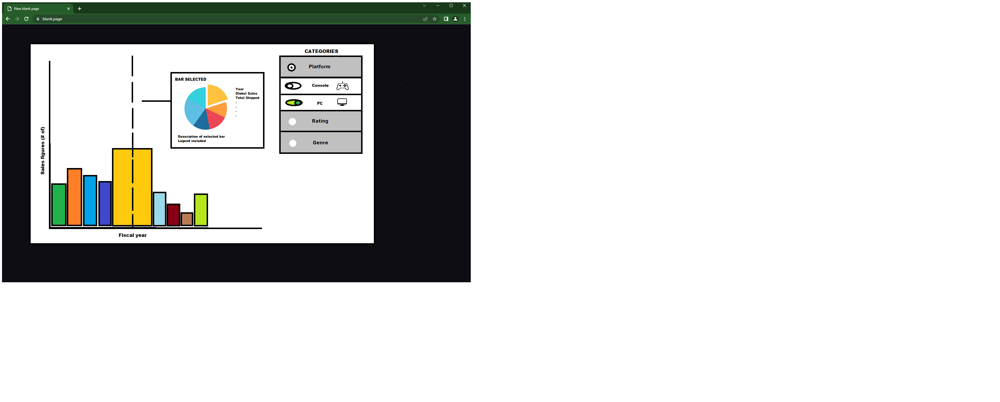
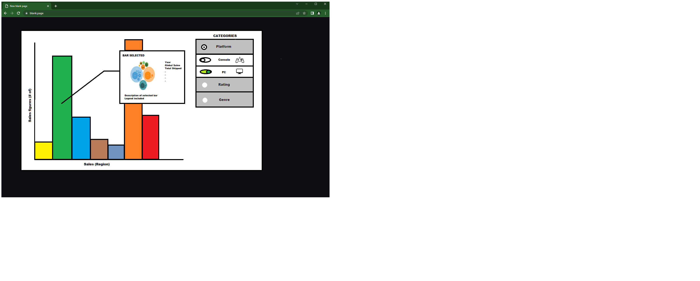
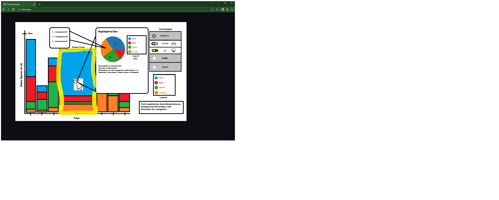

# Rated **‘V’** for Visualization
_Project proposal of Visualization for Data Science (CS 6630) - Fall 2022_ <br/>
**Website: [V for Visualization](https://mdrahmed.github.io/dataVisProject/#)**
## Background and Motivation
Our team shares an interest in social trends and media, and this shared interest was the driver for our exploration of subject-matter. The nascent medium of video games was a natural choice to explore further, given the underdevelopment of the industry and its documentation relative to other industries like music and film. Our project has since expanded in scope, but our original idea was to document the proportion of video games with a given content rating sold within each year—and, in-turn, the trends associated with that proportion over time.
Upon review, we discovered that visualizations of industry-wide sales trends for the United States are available directly from the [Motion Picture Association of America](https://www.motionpictures.org/wp-content/uploads/2022/03/MPA-2021-THEME-Report-FINAL.pdf) (MPAA) and [Recording Industry Association of America](https://www.riaa.com/u-s-sales-database/) (RIAA) for the mediums of film and music respectively, but no similar organization exists for the medium of video games, and no similar visualizations are publicly available. We are motivated to fill this niche ourselves, using independently-sourced data, for the sake of completeness and discovery.

## Project Objectives
Our project aims to illustrate video game sales data in a broad sense, using interactive visualizations to plot industry-wide sales figures on a per-year basis. These visualizations should be easy-to-use, especially for users who are unfamiliar with the industry, and we intend to build our visualization as a flexible tool. Web visualizations have, as an advantage over visualizations constrained to static media, the capacity for extensive interaction, and we intend to leverage this to a high degree: at any given time, the information immediately in-frame should be limited enough to not be overwhelming, and user-driven options to explore related information should be clearly available. Users could later modify the graphic to examine the usage ratio depending on other categories, such as rating and genre. A stacked bar chart with years on the x-axis and sales on the y-axis will initially be shown based on different platforms. To allow users to examine the usage of the games exclusively for that particular category, we will provide options inside each category. The user will be able to assess the popularity of video games using a waffle chart and legends since we will make each and every bar clickable. The description of the selected bar in the waffle chart will be displayed, along with a breakdown of the subcategories' information, such as publisher, developer, worldwide sales, and, shipping etc. Our first plan was to make a pie chart, but we later realized that a waffle chart would be more effective. A waffle chart displays the amount of progress achieved toward a goal or the percentage of completion. A wonderful technique to display data in relation to the whole is via waffle charts. When dealing with sales, pie charts that demonstrate growth toward a specific threshold and are overly diversified by genre, platform, etc. By hovering over the chart's components, you'll be able to see the waffle pattern. Once more, when that waffle chart is clicked, a different graphic will show the breakdown data and components in greater depth. 

We will learn how to create interactive graphics with various charts based on a small subset of data extracted from a large set of data. We will be able to deal with a large dataset. We will discover how to link human thinking with the images, turning this representation into an interactive one.

## Data
The largest data-set for video game sales records that is both publicly-accessible and up-to-date is maintained by the VGChartz Network, which has a web portal for browsing records [here](https://www.vgchartz.com/gamedb/).

## Data Processing
We will need to perform significant data cleanup, as our source does not provide its data in a user-friendly format. Fortunately, there exists [an open-source web-scraping Python script](https://github.com/ashaheedq/vgchartzScrape) for the VGChartz online database, which uses the BeautifulSoup library to deliver a CSV-formatted file containing the following fields:  
```JSON
['Rank', 'Name', 'basename', 'Genre', 'ESRB_Rating', 'Platform', 'Publisher', 'Developer', 'VGChartz_Score', 'Critic_Score', 'User_Score', 'Total_Shipped', 'Global_Sales', 'NA_Sales', 'PAL_Sales', 'JP_Sales', 'Other_Sales', 'Year', 'Last_Update', 'url', 'status']
```

Of note is that not every game has information available for every field, and some fields are inconsistently represented: for example, in 1998, the Entertainment Software Rating Board (ESRB) changed the name of its “Kids to Adults” rating category, so it’s likely that we’ll need to standardize the ESRB rating field to group records filed under both names as belonging to the same category. Similarly, we’ll have to decide how to account for games with unknown publishers, unusual platforms, and unspecified genres, depending on how many are present in the data.
Separately, some portions of our data may be incomplete–some platforms or years, especially very recent ones, may be missing a substantive number of entries altogether. We will not know until gathering our data how pervasive a problem this may be, but it may prove to be a challenge.

## Visualization Design 
Simplicity is the key to unlock dense information with visualization. In this project, the visual will be an interactive bar chart which can be interchanged based on the category selected by the user. Once the user has selected their desired data category, they can filter on one or multiple items that fall under the category. 

_Example: The category selected is ‘Platform’. There are several ways a gamer can play games. The usual platform systems used are consoles, mobile phone/tablet, and personal computer (pc). The user can filter specifically on one system or multiple systems and see the visual output._ 

Hand drawn sketches:





_(Note: Hand sketches were done to brainstorm the alternative prototypes prior to them being implemented in Microsoft Paint)._

The following are three alternative prototype designs: 

###### Design #1 


For our first design, we wanted to start off simple, organized and direct. It was determined that a traditional bar chart visual would be the best approach to display different categorical data groups. We have in the top-right corner a ‘Categories’ menu that will have several options to choose from. Once a category is selected (radio button), a drop down widget will appear to present several sub-categorical options to filter down by a specific item/trait. Once the filtering has been completed by the user, the bar chart will update the results based on the combination of filters. Next, the user will have the ability to click/select a particular bar to see the makeup of the bar in a waffle chart. This chart will include a breakdown legend of the different pieces of the waffle chart as well as an accompanying information field containing narratives, stats, and key facts. This first design serves as a solid foundation to build on for the final design.

###### Design #2


For our second design, we were thinking of other possibilities for our sub-visualization. When the user wants to select a particular bar a bubble chart will appear, similar to the waffle chart in design #1. Also, hovering over the visual with the mouse cursor felt much more interactive than clicking in/out of individual bars. 

###### Design #3


For design #3, a vertical-dashed line was rendered for additional interaction with the user. When the line is overlapping a desired bar the sub-visual would appear. However, the sub-visual has been reverted back to the original waffle chart. It was determined that a bubble chart would be a valiant option to use, but the limited size of the pop-up box would put a greater limit on the chart’s scale. This possibly could put unneccesary strain on the viewer's gaze and possibly hide key takeaways for the selected bar.

###### Final Design


Key-strengths from each of the design prototypes were discussed and approved for the final design as well as adding a few new options. Stacked bars seemed the best way to distinguish the different gaming platforms' sales performances over the span of 34 years. A legend for the stacked bars will be included in the bottom-right corner accompanied with supportive text. This will support the visual with organization and informing the viewer before/during usage.

Like the other designs, hovering was deemed the simplest and most convenient way for a user to interact with the visualization. The rendered line was an idea for the third design, but it was deemed as an “over-need” for simplicity in the visual. A new feature added for the cursor is when the cursor clicks on a desired bar, the bar increases (smooth animated transition) and stands out in scale compared to the unselected bars. Next, the user can hover over the selected stacked bar and a pop-up will appear. The pop-up box will still include condensed, clear narrative information to educate the viewer of the determined findings. The box itself will increase in size and will overlap (brought forward) over the unselected bars in the chart. The sub-visual (waffle chart confirmed) will be inside the box once the hover is over the desired bar group. This visual will include features of correlating the same color of the bar with the leading driver, categorical percentages, and narrative information for each slice of the waffle. When the viewer clicks a slice of the waffle, a descriptive breakdown of subcomponents of that slice will appear in another pop-up box which contains additional sub data correlating to the parent categorical slice. These features will give a complex depth to the visual and give the viewer freedom to try various searching combinations.

The team is open to suggestions for improvement from the assigned mentor and peers to deliver an effective visualization of gaming data by December 2nd. 


## Must-have Features

The following features are to be interpreted as components of the visualization design described above:

1. The basic bar chart is drawn, with each bar representing a year, and its height representing overall video game sales figures within that year.
2. The bar chart is updated to include or exclude data-entries according to the selected toggles.
3. The individual bars feature stacked groups, based on the currently-selected categorical radio-button.
4. A dynamic legend is drawn and updated according to the currently-selected categorical radio button and included data entries.
5. The bar-chart is interactive: clicking on the bar chart displays a smaller sub-visualization that includes a waffle chart encoding of the information local to that bar.

## Optional Features 

The optional features are listed below,

1. The y-axis may be toggled between two different, related quantities: number of games published, and number of units sold.
2. Hovering over a waffle chart segment displays a small block of text describing the category it represents.
3. Every waffle chart sub-visualization is split into smaller sub-categories, where applicable.


## Project Schedule
This project schedule aligns with the class schedule layout. Due dates for deliveries as well as delegated tasks are included. 
 - Week 9 
   - Andrew, Harrison, & Raihan - Project proposal submission (Due: Oct 21st)
 - Week 10 
	 - Andrew - HTML, SVG Layout, CSS
   - Harrison - Data Processing & Cleaning (web scraping)
   - Raihan - Bar chart
   - All - Figure out as a team on how to launch webpage (Docker - AWS)
 - Week 11
   - Andrew - Categories SVG
   - Harrison - Legend (dynamic)
   - Raihan - Waffle Chart
 - Week 12 - Project milestone submission (Due: Nov 11th)
   - Andrew, Harrison, Raihan  - Work on assigned task(s) for process book/milestone delivery.
   - All - Compile project milestone submission, conduct mid-project review, testing prototype, troubleshoot if needed.
 - Week 13 - Project review with mentor
   - All - Meet with TA, discuss and delegate new assignments based on feedback given.
 - Week 14 - Thanksgiving Break (Nov 24th - Now 27th)
	- All - Reserve for clean-up/testing
- Week 15 - Final project submission/presentation (Due: Dec 2nd)
   - All - Finish up last finishing touches on deliverables (code, process book, recorded screencast) and deliver final design in class.
 
***Project schedule is subjected to possible edits/revisions if needed.

## Contact Information

If the instructor or TA needs to contact one or all team members, contact information is provided below: 

Raihan Ahmed (u1374605)	  	Email: u1374605@utah.edu <br/>
Harrison Fackrell (u1292786)		Email: u1292786@utah.edu <br/>
Andrew Frost (u0899003)		Email: u0899003@utah.edu <br/>

Project repo: [Rated **‘V’** for Visualization](https://github.com/mdrahmed/dataVisProject)
